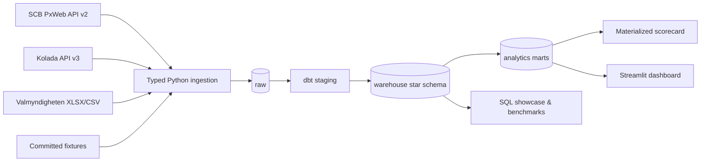

# Municipal Data Warehouse

[Svensk version](README.sv.md) · [Architecture](docs/architecture.md) · [Data dictionary](docs/data_dictionary.md) · [SQL showcase](sql/showcase)

A reproducible analytics warehouse for Swedish municipal open data. It turns population statistics from SCB, municipal KPIs from Kolada, and election results from Valmyndigheten into tested dimensional models, decision-ready marts, and a SQL-backed Streamlit dashboard.

This repository is designed as a realistic Analytics Engineering system: source contracts, batch lineage, dimensional grain, data quality, query plans, and operational documentation are first-class deliverables.

## What it demonstrates

- PostgreSQL warehouse design with conformed dimensions, Type-2 history, facts, PK/FK constraints, and indexes.
- Python ingestion with typed contracts, retries, lineage, checksums-ready batch metadata, and idempotent replacement loads.
- dbt staging, snapshots, marts, tests, documentation, and reusable SQL macros.
- Advanced SQL applied to municipal questions: windows, percentiles, recursive CTEs, set operations, pivot/unpivot, and transactions.
- Reproducible performance analysis using `EXPLAIN (ANALYZE, BUFFERS)`.
- A read-only Streamlit application whose transformations remain in dbt.
- Deterministic offline CI plus a separately configured live refresh.

## Architecture



The schemas are deliberately separated by responsibility:

| Schema | Contract |
|---|---|
| `raw` | Source-shaped, typed records plus ingestion metadata |
| `staging` | Renamed, standardized, filtered, and age-banded views |
| `warehouse` | Conformed dimensions and facts with explicit grain |
| `analytics` | Stable decision-oriented datasets consumed by the app |

See [architecture.md](docs/architecture.md) and the [ER diagram](docs/erd.md).

## Quick start

Prerequisites: Docker Desktop, Docker Compose v2, GNU Make, and approximately 2 GB free disk space.

```bash
git clone <repository-url>
cd municipal-data-warehouse
cp .env.example .env
make demo
make dashboard
```

Open [http://localhost:8501](http://localhost:8501). `make demo` uses only committed fixtures after the Docker image is available; it does not call source APIs. Run `make help` for the command catalog.

### Live refresh

Review `ELECTION_SOURCE_URL`, the configured SCB years, and Kolada KPI IDs, then run:

```bash
make refresh
```

The default election source is Valmyndigheten's official 2022 district-level XLSX. The adapter separates party rows from published totals, aggregates to municipality-party grain, and also accepts a normalized CSV contract. That workbook contains votes but not mandates, so live `seats` values are `NULL`. Valmyndigheten changes filenames between elections, so the URL remains explicit rather than relying on fragile page scraping. SCB table `TAB638` requests are split by year to respect API cell limits.

## Dimensional model

The central facts have intentionally different grains:

| Fact | Grain | Measures |
|---|---|---|
| `fact_population` | municipality × year × sex × age band | population count |
| `fact_municipal_kpi` | municipality × year × KPI × demographic variant | metric value |
| `fact_election_result` | municipality × election year × party | votes, share, optional seats |

`dim_municipality`, `dim_region`, `dim_time`, and `dim_demographic` are conformed across domains. Metric and party dimensions preserve domain-specific semantics. Municipality history is captured with a dbt Type-2 snapshot; fact models use deterministic surrogate keys and the current administrative version.

## Analyses

The repository answers questions such as:

- Which municipalities grow fastest, and has that growth persisted?
- How does eldercare cost relate to satisfaction and population structure?
- Which municipalities are outliers relative to their peers or national distribution?
- How did municipal party vote shares and ranks change between elections?
- Where do source systems disagree on municipality-year coverage?

The [SQL showcase](sql/showcase) maps each technique to a real analytical or engineering question. The production marts reuse the same definitions so dashboard numbers reconcile with documented SQL.

## Data quality and observability

- Pydantic rejects invalid municipality codes, years, demographic values, negative counts, and malformed KPI IDs before load.
- Raw tables enforce source grain with primary keys and domain checks.
- dbt tests assert uniqueness, referential integrity, valid vote shares, one current municipality version, and municipality-year grain.
- Every load records mode, source manifest, timestamps, status, and row counts in `raw.ingestion_batch`.
- The dashboard exposes pass/fail warehouse assertions, source freshness, and loaded-row counts.
- CI builds the complete fixture warehouse in an empty PostgreSQL instance.

## Performance

`make benchmark` captures PostgreSQL plans and buffer statistics in `artifacts/benchmark.txt`. The serving layer includes composite indexes for dominant access paths and a uniquely indexed materialized scorecard.

Partitioning is intentionally not used in v1: the expected fact size does not justify its operational cost. The decision and reconsideration threshold are documented in [ADR-002](docs/adr/002-no-partitioning-yet.md). See [performance.md](docs/performance.md) for the benchmark protocol.

## Repository map

```text
src/municipal_dw/   source adapters, contracts, loading, CLI
dbt/                staging, snapshots, dimensions, facts, marts, tests
sql/showcase/       advanced SQL tied to municipal questions
sql/performance/    reproducible query-plan capture
dashboard/          thin Streamlit UI and parameterized query layer
data/fixtures/      compact deterministic, non-authoritative demo snapshot
tests/              source-contract and parser unit tests
docs/               architecture, dictionary, ADRs, source and QA notes
.github/workflows/  full warehouse CI and weekly source-contract monitoring
```

## Development

```bash
uv sync --all-extras  # optional host-side environment; Docker uses uv.lock as well
make demo       # full fixture pipeline
make test       # pytest + dbt tests
make lint       # Ruff + SQLFluff
make benchmark  # query plans
make docs       # dbt catalog and lineage
make down       # retain data
make reset      # explicitly remove the local database volume
```

Do not use fixture values for substantive conclusions. They are synthetic, compact contract examples. `make refresh` is the source-backed path.

## Roadmap

- Add municipality boundary geometry and map-based comparisons.
- Add unemployment as a fourth domain after its metric ownership and historical consistency are documented.
- Publish versioned source extracts as release artifacts rather than growing the Git repository.
- Add orchestration only when refresh frequency and failure-handling requirements justify it.

## License and attribution

Code is licensed under MIT. SCB open data is CC0. Valmyndigheten data is free to use with attribution. Kolada requires source attribution and warns that transformed results must not be represented as official Kolada output. See [NOTICE.md](NOTICE.md) and [source_catalog.md](docs/source_catalog.md).
