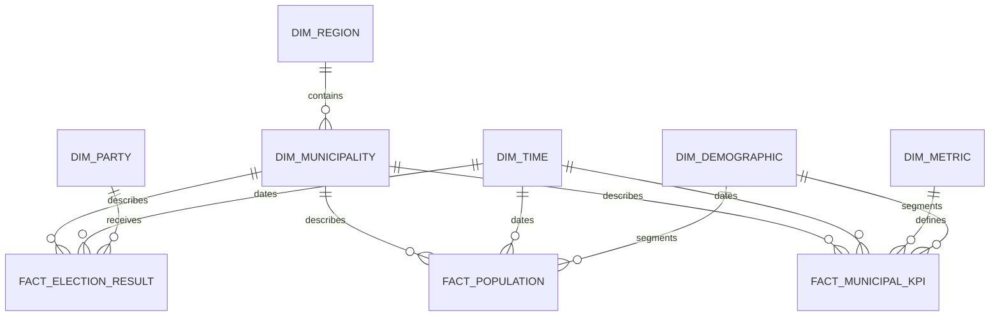

# Entity relationship diagram

Surrogate keys are 32-character deterministic hashes. Natural identifiers such as SCB municipality code and Kolada KPI ID remain visible for lineage and interoperability.

